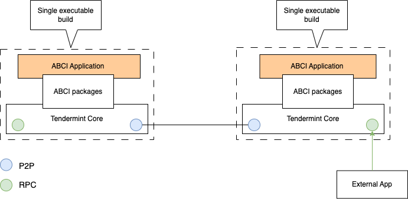
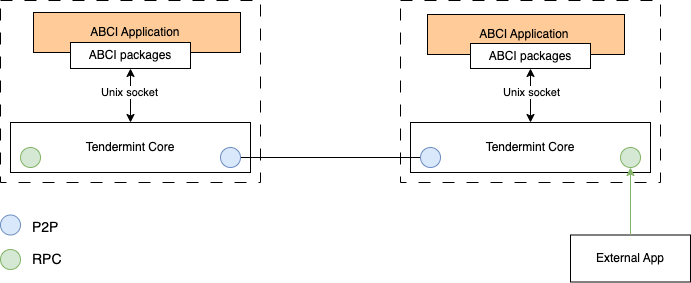

# Tendermint

The topics covered in this section are:

* [Overview](#overview)
* [Docker Base image](#docker-base-image)
* [The Tendermint Components](#the-tendermint-components)
* [ABCI Application](#abci-application)
* [References](#references)

## Overview

First, Tendermint and Cosmos or Cosmos SDK belongs to the same family of software tools. We won't elaborate on the differences between the tools. You can read the difference in [Tendermint & Cosmos SDK Demystified](https://medium.com/coinmonks/tendermint-cosmos-sdk-demystified-47385cf77cf6). For now, think of Tendermint as the basic building block of Cosmos. We'll discuss the features of Cosmos details in other section of this project.

Second, the term `tendermint` encompass several things, and these are:

* an open source Go based projects;
* a practical Byzantine Fault Tolerant (pBFT) consensus engine - i.e. the Tendermint Core;
* a library for the creation of Application Blockchain Interface (ABCI) applications.

These elements combined to help you developed replicated state machines or Layer 1 of a blockchain protocol.

## Docker Base Image

To support a series of working examples we have provided mechanism to build a base image see [specification](../build/tmint/base.dockerfile). The base image provides installed version of tendermint core derived from its [source code](https://github.com/tendermint/tendermint.git).

## The Tendermint Components

* [Tendermint source code](#tendermint-source-code)
* [Tendermint core](#tendermint-core)

### Tendermint Source Code

Tendermint's source code is located in [(https://github.com/tendermint/tendermint.git](https://github.com/tendermint/tendermint.git).

You use the source to generate:

* an orchestration tool named `tendermint` to manage a running `tendermint core`;
* a Go based packages (or libraries) to help you build `ABCI` application;
* an `ABCI-CLI` tool to help you debug ABCI applications.

### Tendermint Core

The tendermint core is an process comprising of these components:

* a pBFT consensus engine;
* a P2P networking protocol;
* an JSON RPC protocol.

The pBFT consensus engine ensures that transactions sent to a network of nodes are recorded in the right order. The consensus algorithm is described in [what is tendermint?](https://docs.tendermint.com/v0.34/introduction/what-is-tendermint.html).

The P2P protocol enable nodes hosting the tendermint core, is the basis for nodes to communicate with each other on a peer-to-peer basis.

The JSON RPC protocol enable client applications to communicate (i.e. send transactions) with the tendermint core.

## `ABCI` Application

The ABCI application, not be confused with client applications is something you create to serve as a state machine. You implement the state machine based on a number of interfaces. Please refer to [official specification](https://github.com/tendermint/spec/tree/95cf253b6df623066ff7cd4074a94e7a3f147c7a/spec/abci) for the complete list of interfaces. Here, we'll focus on these:

* `CheckTx`
* `BeginBlock`
* `DeliverTx`
* `EndBlock`
* `Commit`

To mutate the ABCI application, you sent a transaction like this: `<URL root>/broadcast_tx_commit?tx="name=satoshi"` -- e.g. using curl to the tendermint core. Please refer to the [official transaction format](https://docs.tendermint.com/v0.34/rpc/)

When a transaction is sent to tendermint core, it calls the ABCI application `CheckTx`. You implement this function to validate transactions -- e.g. validate transaction signature, etc.

When tendermint core initiate a block, it calls ABCI application member function named `BeginBlock`. You implement this interface to initiate the start of a state session. 

On completion of the `BeginBlock`, the core calls the function named `DeliverTx`. On completion of that function the core calls `EndBlock` for one more check. Thereafter the `Commit` is called and the state machine is committed. 

When a query transaction (e.g. `/abci_query?data="name"`) is sent to tendermint core, the ABCI application member function `Query` is called.

An ABCI application interact with the tendermint core either as:

* an integrated process with tendermint core.
* a separate process.

### ABCI application integrated with tendermint core

You build this type of application using ABCI Go package [ABCI Go package](https://github.com/tendermint/tendermint/tree/v0.34.x/abci). Please refer to the [ABCI specification](https://github.com/tendermint/tendermint/tree/v0.34.x/spec/abci) for more information. The relationship between ABCI application and Tendermint core (see Figure 1).

 
<b>Figure 1:</b> ABCI application package as a single executable with tendermint core.

Here is a working example:

* [Solo Image](../build/tmint/solo.dockerfile) - This image is derived from the base image that incorporate Ex1 application
* [Ex1](../cmd/tmint/ex1/main.go) - This is the source code for the combine tendermint core and state machine
* [Deployment network](../deployments/tmint/solo_ex1.yml) - This network has one Solo container `ex1_node` embedded with `Ex1` application.
* [./scripts/tendermint.sh](../scripts/tendermint.sh) - This script provides the mechanism to build solo image, start, and stop ex1 image.
* [Curl base transaction script](../examples/tmint/curl/txn.sh).

### ABCI application as a separate process

In this configuration, the ABCI application runs in a separate process. The application and tendermint core communicate via sockets (see Figure 2).

 
<b>Figure 2:</b> Socket based ABCI application

You will find an example of a socket-base ABCI app [here](../cmd/tmint/ex2/main.go).

Here is a working example:

* [Solo Image](../build/tmint/solo.dockerfile) - This image is derived from the base image that incorporate Ex1 application
* [Ex2](../cmd/tmint/ex2/main.go) - This is the source code for the combine tendermint core and state machine
* [Deployment network](../deployments/tmint/solo_ex2.yml) - This network has one Solo container `ex2_1` running the ABCI application, and a container `ex2_2` running the tendermint core.
* [./scripts/tendermint.sh](../scripts/tendermint.sh) - This script provides the mechanism to build solo image, start, and stop ex1 image.
* [Curl base transaction script](../examples/tmint/curl/txn.sh).

## References

* [Tendermint Explained — Bringing BFT-based PoS to the Public Blockchain Domain](https://blog.cosmos.network/tendermint-explained-bringing-bft-based-pos-to-the-public-blockchain-domain-f22e274a0fdb)
* [Tendermint Core EXPLAINED (Algorithm & History)](https://www.youtube.com/watch?v=kTczTT9DlP8)
* [Revisiting Tendermint: Design Tradeoffs, Accountability, and Practical Use](https://www.youtube.com/watch?v=UCuNBukWfAM)
* Tendermint Demo
    * [Tendermint Tutorial Demo - Part 1](https://www.youtube.com/watch?v=pVMFMiZGunw)
    * [Tendermint Tutorial Demo - Part 2](https://www.youtube.com/watch?v=wko5DPM-9Gs)