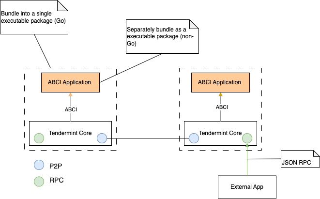

# Tendermint

Tendermint is a tool to help you spin up replicated application across multiple machine that is Byzantine Fault Tolerant (BFT). There are two major components: consensus engine and Application BlockChain Interface (ABCI). For detailed description please refer to [what is tendermint?](https://docs.tendermint.com/v0.34/introduction/what-is-tendermint.html).

 
Figure 1: Tendermint architecture

## The consensus engine

The consensus engine, also known as the Tendermint Core, ensures that the same transaction is recorded on every machine that host the `tendermint` node. 